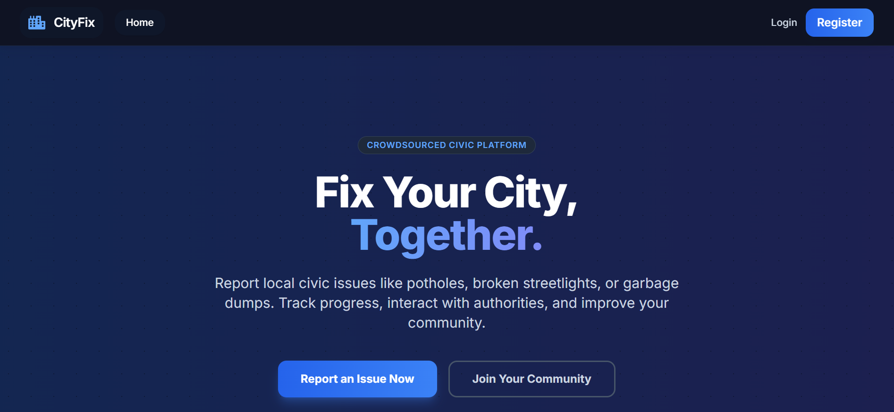
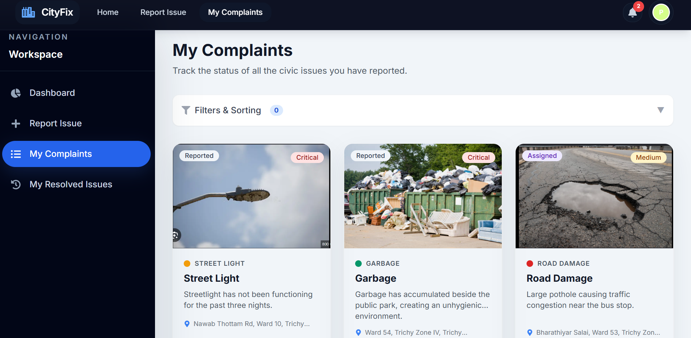
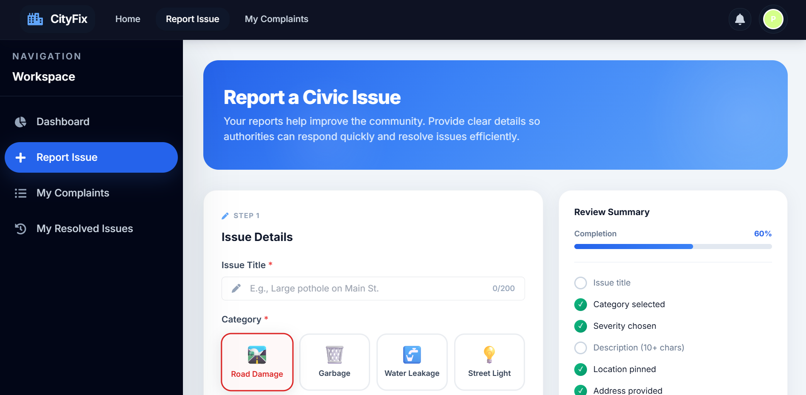
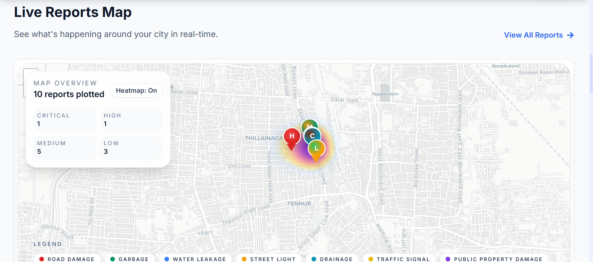
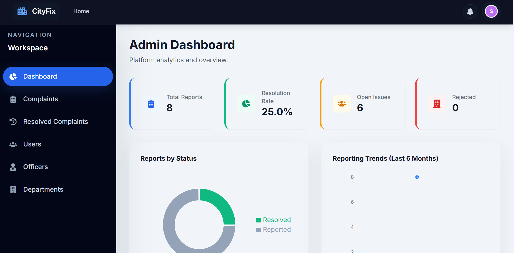
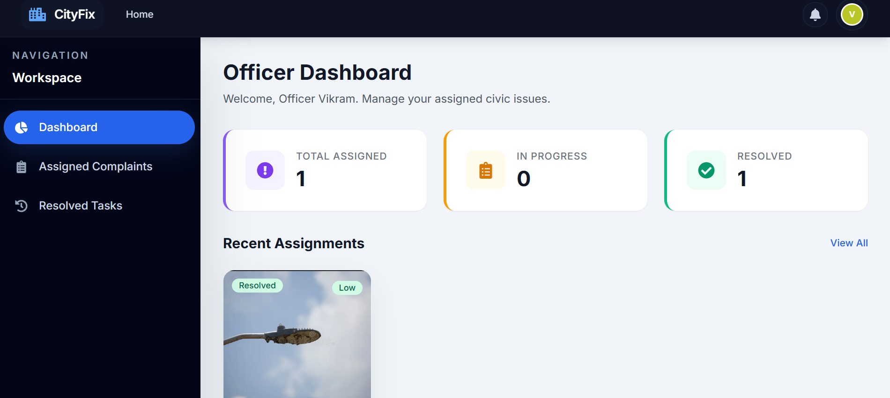

# 🏙️ CityFix – Crowdsourced Civic Problem Reporting Platform

CityFix is a full-stack MERN web application that enables citizens to report civic infrastructure issues such as potholes, garbage accumulation, water leakage, damaged streetlights, and other public problems.

The platform streamlines the complaint lifecycle by allowing administrators to assign reports to departments and officers, while officers update issue statuses until resolution. Citizens receive real-time updates throughout the process.

## 📸 Screenshots

### 🏠 Home Page
Landing page showcasing recent civic reports and platform overview.



### 👤 Citizen Dashboard
Dashboard for tracking complaints, notifications, and activity.



### 📝 Report Issue
Interactive complaint submission with image upload and map location selection.



### 🔥 Heatmap
Geographical visualization of complaint density across locations.



### 🛠 Admin Dashboard
Complaint management, department assignment, analytics, and user administration.



### 👮 Officer Dashboard
Assigned complaints with status updates and resolution workflow.



## 🚀 Tech Stack

| Layer | Technology |
|-------|-----------|
| Frontend | React 18 + Vite, Tailwind CSS v3, React Router v6 |
| Maps | React Leaflet + OpenStreetMap |
| Charts | Recharts |
| Backend | Node.js + Express.js |
| Database | MongoDB + Mongoose |
| Auth | JWT + bcrypt |
| Images | Multer + Cloudinary |

## 📋 Features

- **Citizens**: Report issues with photos & location, track status, upvote, comment, follow
- **Officers**: View assigned complaints, update status, add resolution notes
- **Admins**: Manage users/departments, assign complaints, view analytics dashboard

## 🛠️ Setup

### Prerequisites
- Node.js 18+
- MongoDB (local or Atlas)
- Cloudinary account (free tier)

### Backend Setup
```bash
cd server
cp .env.example .env
# Edit .env with your MongoDB URI, JWT secret, and Cloudinary credentials
npm install
npm run dev
```

### Frontend Setup
```bash
cd client
npm install
npm run dev
```

### Environment Variables

See `server/.env.example` for required variables:
- `MONGODB_URI` – MongoDB connection string
- `JWT_SECRET` – Secret key for JWT tokens
- `CLOUDINARY_CLOUD_NAME`, `CLOUDINARY_API_KEY`, `CLOUDINARY_API_SECRET` – Cloudinary credentials
- `CLIENT_URL` – Frontend URL for CORS

## 📁 Project Structure

```
├── client/          # React Frontend (Vite)
│   └── src/
│       ├── api/         # Axios API modules
│       ├── components/  # Reusable UI components
│       ├── context/     # React Context providers
│       ├── hooks/       # Custom hooks
│       ├── pages/       # Page components
│       └── utils/       # Helpers & constants
│
├── server/          # Express Backend
│   ├── config/      # DB & Cloudinary config
│   ├── controllers/ # Route handlers
│   ├── middleware/   # Auth, roles, upload
│   ├── models/      # Mongoose schemas
│   ├── routes/      # Express routes
│   └── utils/       # Helper functions
```

## 📡 API Endpoints

| Method | Endpoint | Description |
|--------|----------|-------------|
| POST | `/api/v1/auth/register` | Register new user |
| POST | `/api/v1/auth/login` | Login |
| GET | `/api/v1/reports` | List reports (with filters) |
| POST | `/api/v1/reports` | Create report |
| GET | `/api/v1/reports/:id` | Get report details |
| PUT | `/api/v1/reports/:id` | Update report status |
| POST | `/api/v1/reports/:id/upvote` | Toggle upvote |
| POST | `/api/v1/reports/:id/comments` | Add comment |
| POST | `/api/v1/reports/:id/follow` | Toggle follow |
| GET | `/api/v1/notifications` | Get notifications |
| GET | `/api/v1/admin/analytics` | Admin analytics |

